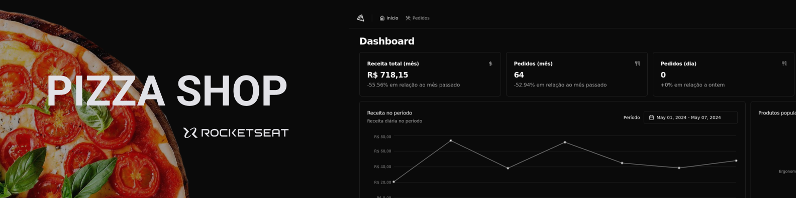
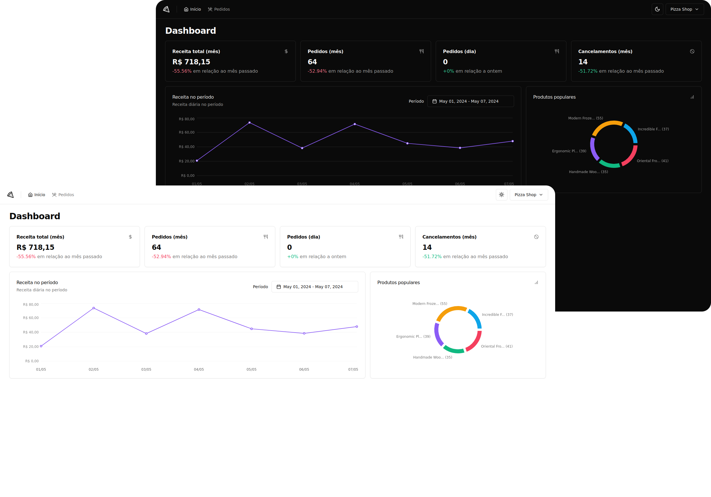

  

  
  <a aria-label="Completed" href="https://rocketseat.com.br/">
    </img>
</a>
    

## :speech_balloon: Visão Geral

Esse projeto foi construído durante o programa Ignite da [Rocketseat](www.rocketseat.com.br) e teve como objetivo exercitar conceitos do React, principalmente em relação a comunicação com APIs via requisições HTTP.  
A aplicação é um painel administrativo de uma pizzaria, onde é possível verificar as principais métricas do estabelecimento bem como realizar a administração dos pedidos realizados.

## :camera: Preview

  

### Funcionalidades

- Passwordless: Login do usuário usando magic link.
- Dashboard: Página para exibição da principais métricas do estabelecimento, como:
  - Receita total
  - Número de pedidos
  - Número de cancelamentos
  - Gráfico com a receita diária dentro de um período específico
  - Gráfico contendo os pedidos mais populares
- Listagem de pedidos: Consumo de API para busca e administração dos pedidos do estabelecimento.

 

A seguir, alguns dos conceitos postos em prática durante o desenvolvimento:

- React Hooks (useState, useCallback, useContext)
- Consumo de API com axios
- TailwindCSS
- ContextAPI
- Roteamento com React Router
- React Hook Form
- Construção de interface com shadcn/ui
- Consultas com React Query
- Testes unitários com Vitest e Testing Library
- Testes E2E com MSW e Playwright

## :art: Temas

A aplicação está disponivel nos temas dark e light.

  

## :rocket: Tecnologias Utilizadas

  
  
  
    
  
  
  
  
  
 

 

  Feito com :purple_heart:

