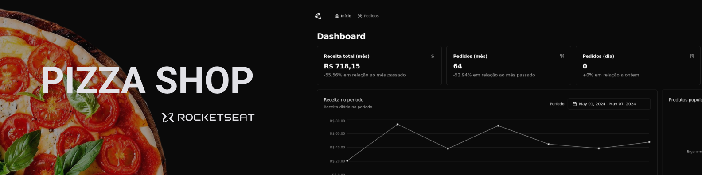

  

  
  <a aria-label="Completed" href="https://rocketseat.com.br/">
    </img>
</a>
    

## :speech_balloon: Overview

This project was built during the [Rocketseat](www.rocketseat.com.br) Ignite program and aimed to exercise React concepts, mainly in relation to communication with APIs via HTTP requests.  
The application is an administrative panel for a pizzeria, where it is possible to check the establishment's main metrics as well as manage orders placed.

## :camera: Preview

  

### Functionalities

- Passwordless: User login using magic link.
- Dashboard: Page to display the establishment's main metrics, such as:
  - Total revenue
  - Number of orders
  - Number of cancellations
  - Chart with daily revenue within a specific period
  - Chart containing the most popular orders
- Order listing: API consumption for searching and managing the establishment's orders.

 

Below are some of the concepts put into practice during development:

- React Hooks (useState, useCallback, useContext)
- API consumption with axios
- TailwindCSS
- ContextAPI
- Routing with React Router
- React Hook Form
- Construction of interface with shadcn/ui
- Queries with React Query
- Unit tests with Vitest and Testing Library
- E2E tests with MSW and Playwright

## :art: Themes

The application is available in dark and light themes.

  

## :rocket: Technologies

  
  
  
    
  
  
  
  
  
 
 

  Made with :purple_heart:

